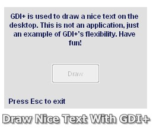



## Draw Text On Desktop Using GDI\+

### Description

Draw a nice text on the desktop using GDI+.
 
### More Info
 

             |
---                |---
**Submitted On**   |2006-03-15 06:31:44
**By**             |[Carlos\-Sz](https://github.com/Planet-Source-Code/PSCIndex/blob/master/ByAuthor/carlos-sz.md)
**Level**          |Intermediate
**User Rating**    |4.6 (23 globes from 5 users)
**Compatibility**  |VB 6\.0
**Category**       |[Graphics](https://github.com/Planet-Source-Code/PSCIndex/blob/master/ByCategory/graphics__1-46.md)
**World**          |[Visual Basic](https://github.com/Planet-Source-Code/PSCIndex/blob/master/ByWorld/visual-basic.md)
**Archive File**   |[Draw\_Text\_1980993182006\.zip](https://github.com/Planet-Source-Code/carlos-sz-draw-text-on-desktop-using-gdi__1-64694/archive/master.zip)

